# ML Figure Template

**Current version:** v0.0.1

Interactive architecture diagrams for ML project pages.

## Quick Start

Just drop the two files `ml-figure-template.js` and `ml-figure-template.css` (from the `lib/` folder) into your project
(e.g., alongside your `index.html`, or in a subfolder like `static/`).

Then, load them in your HTML:
```html
<link rel="stylesheet" href="ml-figure-template.css">
<script defer src="ml-figure-template.js"></script>
```

And create your first diagram:
```html
<div class="mlfig" id="my-diagram">
  <script type="application/json">
  {
    "arrows": [
      { "from": "encoder", "to": "decoder" }
    ]
  }
  </script>
  <div class="mlfig-grid" style="display: grid; grid-template-columns: 1fr; gap: 2rem;">
    <div class="mlfig-block" id="encoder">Encoder</div>
    <div class="mlfig-block" id="decoder">Decoder</div>
  </div>
</div>
```

See this example in action: [quickstart1.html](https://ivrl.github.io/ml-figure-template/docs/quickstart1.html)



Each diagram has two parts:
1. **JSON config (`<script type="application/json">`)**: It specifies what to draw (arrows, bounding boxes, paths). In the example above, we draw a single arrow from `encoder` to `decoder`. These blocks are defined in the 2nd part of the diagram.
2. **Block layout (`<div class="mlfig-grid">`)**: One or more containers that lay out the blocks. Under the hood, each container uses a CSS grid. In the example above, we have a grid with one column and 2 rows.

The JavaScript automatically creates SVG canvases behind and/or in front of the blocks to draw arrows and paths.

Now, suppose we want a horizontal layout (2 columns, 1 row). We just change `grid-template-columns`:
```html
<div class="mlfig" id="my-diagram">
  <script type="application/json">
  {
    "arrows": [
      { "from": "encoder", "fromSide": "right", "to": "decoder", "toSide": "left" }
    ]
  }
  </script>
  <div class="mlfig-grid" style="display: grid; grid-template-columns: 1fr 1fr; gap: 2rem;">
    <div class="mlfig-block" id="encoder">Encoder</div>
    <div class="mlfig-block" id="decoder">Decoder</div>
  </div>
</div>
```

Note that we specified `"fromSide": "right"` and `"toSide": "left"` on the arrow. This is because, by default, arrows go from the bottom of the source block to the top of the target block (designed for vertical layouts).
See this example in action: [quickstart2.html](https://ivrl.github.io/ml-figure-template/docs/quickstart2.html).


Now let's build a more complete diagram with input/output blocks, dimension labels on arrows, tooltips, and a foreground path:
```html
<div class="mlfig" id="my-diagram" style="padding-top: 4rem;">
  <script type="application/json">
  {
    "defaults": { "strokeColor": "#374151" },
    "arrows": [
      { "from": "input", "fromSide": "right", "to": "encoder", "toSide": "left", "label": "3&times;512&times;512", "labelRotate": 90, "labelSide": "bottom" },
      { "from": "encoder", "to": "bottleneck", "label": "1&times;1024", "labelSide": "left" },
      { "from": "bottleneck", "to": "decoder", "label": "1&times;1024", "labelSide": "right" },
      { "from": "decoder", "fromSide": "right", "to": "output", "toSide": "left", "label": "1&times;512&times;512", "labelRotate": -90, "labelSide": "top" }
    ],
    "boundingBoxes": [
      {
        "hExtent": ["encoder", "bottleneck", "decoder"],
        "vExtent": ["encoder", "bottleneck", "decoder"],
        "label": "Your awesome model",
        "labelPosition": "bottom"
      }
    ],
    "paths": [
      {
        "layer": "fg",
        "points": [
          { "id": "input", "side": "top", "offsetX": 15 },
          { "id": "encoder", "side": "top", "offsetY": -15, "offsetX": 15 },
          { "id": "decoder", "side": "right", "offsetY": 25, "offsetX": -15 },
          { "id": "output", "side": "left", "offsetY": 20, "offsetX": 20 }
        ],
        "color": "#7c3aed",
        "arrow": true,
        "dashed": "6 6"
      }
    ]
  }
  </script>
  <style>
    #my-diagram .output { text-align: center; font-size: 0.9rem; font-weight: 600; color: #64748b;
                          padding: 0.5rem 0.75rem; background: #f1f5f9; border-radius: 8px; border: 1px dashed #e2e8f0; }
    #my-diagram .small  { padding: 0.45rem 0.8rem; font-size: 0.85rem; margin: 0 0.25rem; }
  </style>
  <div class="mlfig-grid" style="
    display: grid;
    grid-template-columns: 1fr 1fr 1fr;
    grid-template-areas:
      'input   encoder    .'
      '.       bottleneck .'
      '.       decoder    output';
    gap: 3rem 2.5rem;
  ">
    <div class="output small" id="input" style="grid-area: input;">Your awesome input</div>
    <div class="mlfig-block" id="encoder" style="grid-area: encoder;" data-tip="Some details about the encoder">Encoder</div>
    <div class="mlfig-block small" id="bottleneck" style="grid-area: bottleneck;" data-tip="Some details about the bottleneck">Bottleneck</div>
    <div class="mlfig-block" id="decoder" style="grid-area: decoder;" data-tip="Some details about the decoder">Decoder</div>
    <div class="output small" id="output" style="grid-area: output;">Your awesome output</div>
  </div>
</div>
```

This example introduces several new features:
- **Diagram defaults**: A `"defaults"` block at the top of the JSON config sets diagram-wide styling for arrows and paths (here, `strokeColor` overrides the default light grey). Individual arrows can still override these.
- **Grid areas**: Instead of a simple row/column layout, we use `grid-template-areas` to place blocks in a 3x3 grid with named regions like `'input encoder .'`.
- **Arrow labels**: Each arrow can have a `label` (e.g., dimensions).
- **Tooltips**: Add `data-tip="..."` to any block. Hovering over the block or tapping on the block will show the tooltip.
- **Foreground paths**: Smooth curves drawn above the blocks, defined as a list of waypoints.
- **Bounding boxes**: Highlight a group of blocks with a labeled bounding box.
- **Custom styles**: The library only provides `.mlfig-block` and `.mlfig-grid` as core classes. Any other styling (colors, sizes, input/output variants) is defined in a `<style>` block inside the diagram. This keeps the library minimal and lets you define exactly the classes you need.

See this example in action: [quickstart3.html](https://ivrl.github.io/ml-figure-template/docs/quickstart3.html).



## Exporting as SVG

Every interactive diagram renders a small "Save as SVG" button in its bottom-left corner. Clicking it downloads a self-contained `.svg` file of the current diagram, that you can drop straight into a paper. The three images above were produced this way from the quickstart examples.

See more examples in: [index.html](https://ivrl.github.io/ml-figure-template/docs/).

[](https://ivrl.github.io/ml-figure-template/docs/)

[](https://ivrl.github.io/ml-figure-template/docs/)

[](https://ivrl.github.io/ml-figure-template/docs/)

[](https://ivrl.github.io/ml-figure-template/docs/)

[](https://ivrl.github.io/ml-figure-template/docs/)

[](https://ivrl.github.io/ml-figure-template/docs/)

## Citation

If you use this library in your project page or paper, please cite it:

```bibtex
@misc{everaert2026mlfigtemplate,
  author       = {{EPFL-IVRL} and Everaert, Martin Nicolas},
  title        = {{ML} {F}igure {T}emplate: {I}nteractive architecture diagrams for {ML} project pages},
  year         = {2026},
  howpublished = {\url{https://github.com/IVRL/ml-figure-template}}
}
```

## License

Released under the [ML Figure Template License](LICENSE) — based on MIT, with
two added restrictions: you may not remove or hide the attribution / credit
watermark rendered by the library, and you may not repackage the library code
itself and sell it.
